 

  

 

---

## 🧠 Who Am I
<table>
<tr>
<td width="55%">

</td>
<td width="45%" align="center">

</td>
</tr>
</table>

 

### 🔥 Currently

- 🤖 Exploring **Agentic AI workflows** with LangGraph & n8n automation pipelines
- 🏅 AI Mentee at **DJS InfoMatrix** building production-grade AI systems
- 🎯 Competing in hackathons across **AI, ML, Data Science & UI/UX** domains
- 🧪 Researching **multi-modal deep learning** and **RAG pipeline architectures**

 

---

## 🏆 Achievements

 

| &nbsp; | Event | Organizer |
|:---:|---|---|
| 🥇 1st Prize | AI Automation Hackathon | KJSCE |
| 🥇 1st Place – AI/ML Champions | HackNova 2026 | SSJCOE, Dombivli |
| 🥈 2nd Prize | CodeForge 2026 Hackathon | NMIMS MPSTME |
| 🥈 2nd Place | Datazen Case Study Competition | Somaiya |
| 🥈 2nd Place | Artemis UI/UX Hackathon | KJSCE |
| GenAI Domain Winner | Datahack 4.0 | DJSCE |

 

### 🎓 Education

| Degree | Institution | Score |
|---|---|---|
| B.Tech – AI & Data Science | Dwarkadas J. Sanghvi College of Engineering | CGPA: **9.69 / 10** *(3rd Sem)* |

 

---

## 🚀 Featured Projects

<table>
<tr>
<td width="50%" valign="top">

### ⚖️ NyayaZephyr
**AI Legal Intelligence Platform**

Multi-tenant AI platform for legal research & case management. Context-aware document retrieval, multilingual support, AI guardrails.

</td>
<td width="50%" valign="top">

### 🩺 Multi-Modal Disease Prediction
**Medical Deep Learning System**

Combines HRNet, DenseNet & XGBoost for image + metadata fusion. Feature-level ensemble diagnostic pipeline.

</td>
</tr>
<tr>
<td width="50%" valign="top">

### 📚 Kwest
**AI Adaptive Learning Platform**

Auto-generates flashcards, quizzes & summaries from study material. Proposition-Based RAG pipeline with LangGraph + ChromaDB.

</td>
<td width="50%" valign="top">

### 📈 VEDAQ
**AI Quantitative Trading Platform**

Quant trading with ML model training, strategy backtesting, Gemini-powered insights, real-time portfolio risk tools.

</td>
</tr>
</table>

 

---

## 🛠️ Tech Arsenal

### Languages

### AI / ML Frameworks

### Data Science

### Web & Backend

### Databases

### Cloud & DevOps

### Tools & Platforms

### LLM & AI Systems

 

---

## 💼 Experience

| 🏢 Organization | 💻 Role | 📅 Duration |
|:---:|:---:|:---:|
| **DJS InfoMatrix** | AI Mentee | Aug 2025 – Present |

---

## 🌐 Connect

 

<!-- Snake Animation -->

<picture>
  <source media="(prefers-color-scheme: dark)" srcset="https://raw.githubusercontent.com/platane/snk/output/github-contribution-grid-snake-dark.svg">
  <source media="(prefers-color-scheme: light)" srcset="https://raw.githubusercontent.com/platane/snk/output/github-contribution-grid-snake.svg">
  
</picture>

 
